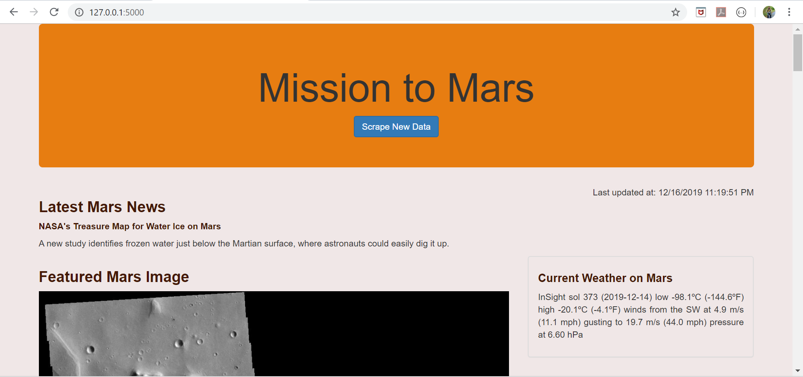
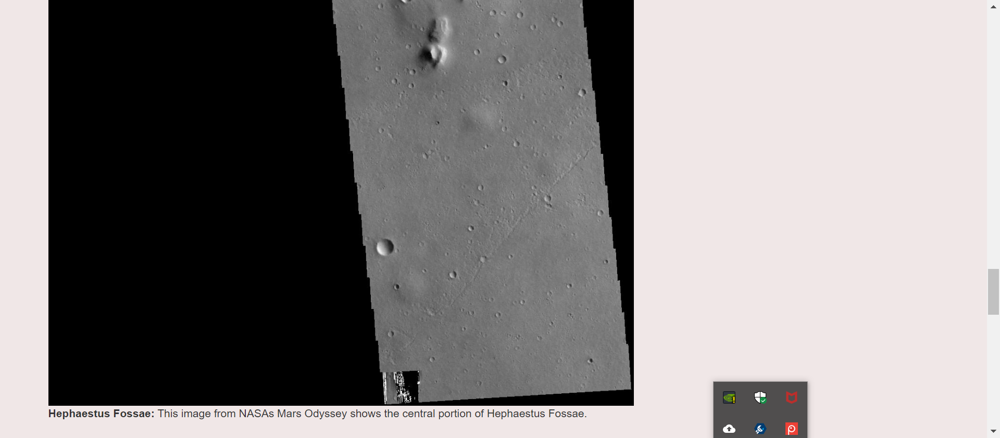
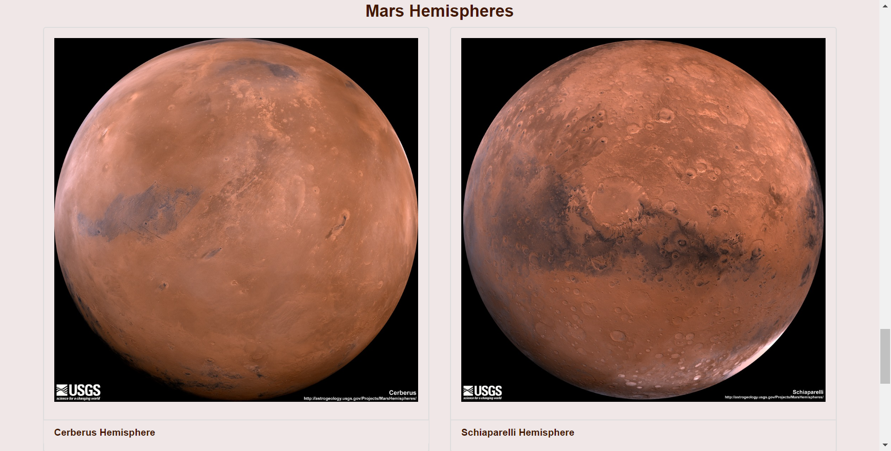
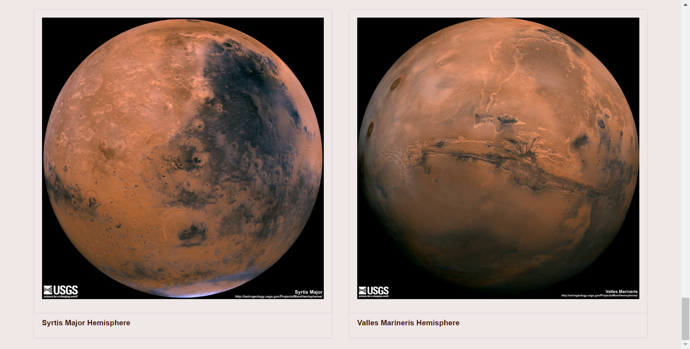

# Home Work Assignment - Web Scrape using BeautifulSoup and Sprinter

## Mars Web Page

### Thank you 

This work is part of the `Web Scrape using BeautifulSoup and Sprinter` by `UOM Data Analysis and Visualization Bootcamp`.

Submited by : Ganeshkumar Gurunathan
